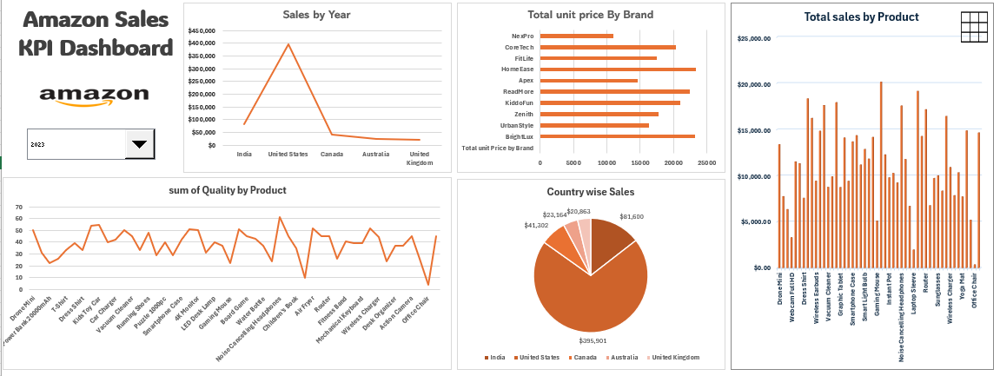

# amazon-sales-kpi-dashboard-excel
Interactive Amazon Sales KPI Dashboard built in Microsoft Excel using Pivot Tables, Pivot Charts, Slicers, and KPI metrics to analyze sales performance, product trends, brand performance, and country-wise revenue insights.

#  Amazon Sales KPI Dashboard (Excel)

## Overview

This project showcases an interactive Amazon Sales KPI Dashboard built using Microsoft Excel. The dashboard transforms raw sales data into meaningful business insights through dynamic visualizations, KPI tracking, and interactive filtering.

The goal of this project is to help businesses and analysts monitor sales performance, identify top-performing products and brands, analyze customer purchasing trends, and make data-driven decisions.

---

## Dashboard Preview

---

## Project Objectives

- Monitor overall sales performance
- Analyze product and brand performance
- Compare sales across countries
- Track quantity sold by product
- Identify top-selling products
- Provide interactive filtering for deeper analysis

---

## Key Performance Indicators (KPIs)

The dashboard tracks:

- Total Sales Revenue
- Total Orders
- Total Quantity Sold
- Average Order Value
- Country-wise Sales Contribution
- Brand Performance
- Product Performance

---

## Dashboard Components

### 1. Sales by Country

Displays sales distribution across:

- India
- United States
- Canada
- Australia
- United Kingdom

**Chart Used:** Line Chart

**Purpose:** Compare sales performance between countries.

---

### 2. Total Unit Price by Brand

Analyzes brand-wise contribution based on unit price.

**Chart Used:** Horizontal Bar Chart

**Purpose:** Identify high-performing brands.

---

### 3. Total Sales by Product

Shows revenue generated by each product.

**Chart Used:** Column Chart

**Purpose:** Discover top-selling products.

---

### 4. Quantity Sold by Product

Tracks units sold for each product.

**Chart Used:** Line Chart

**Purpose:** Understand product demand and customer preferences.

---

### 5. Country-wise Sales Distribution

Visual representation of revenue contribution by country.

**Chart Used:** Pie Chart

**Purpose:** Analyze market share across regions.

---

## Tools & Technologies

- Microsoft Excel
- Pivot Tables
- Pivot Charts
- Slicers
- Data Cleaning
- Data Visualization
- KPI Dashboard Design
- Business Analytics

---

## Skills Demonstrated

- Data Analysis
- Data Cleaning
- Dashboard Development
- Business Intelligence
- Excel Reporting
- KPI Monitoring
- Data Visualization
- Analytical Thinking

---

## Insights Generated

- Identified top-performing products and brands.
- Compared sales performance across multiple countries.
- Analyzed customer purchasing patterns.
- Evaluated product demand through quantity analysis.
- Generated business insights for strategic decision-making.

---

## Dataset Information

The dataset contains Amazon sales transaction records including:

- Product Name
- Brand
- Country
- Quantity Sold
- Unit Price
- Total Sales
- Order Information

---

## Project Outcome

The dashboard provides a centralized view of Amazon sales performance, enabling stakeholders to monitor KPIs, identify trends, and make informed business decisions through interactive and easy-to-understand visualizations.

---

## Author

Soniya Rani M

Aspiring Data Analyst | AI & Data Science Student

LinkedIn: www.linkedin.com/in/soniya-rani-maria-dhasan

---
